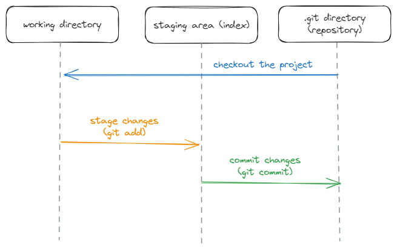

## Навигация:

1. [Начало работы с Git](#начало-работы-с-git)
  - [Виды конфигураций](#виды-конфигураций)
2. [Базовые понятия](#базовые-понятия)
  - [Как связать локальный и удаленный репозиторий?](#как-связать-локальный-и-удаленный-репозиторий)
  - [Как добавить коммит?](#как-добавить-коммит)
  - [Как происходит создание коммита?](#как-происходит-создание-коммита)
3. [Алиасы](#алиасы)
4. [Less](#less)
5. [Git комманды](#git-комманды)
6. [Полезные матриалы](#полезные-материалы)

## <a id="начало-работы-с-git">Перед работой с Git необходимо добавить свое имя пользователя и почту</a>

`git config user.name "Darya Belova"`

`git config user.email "belova.darya.iurevna@gmail.com"`

Чтобы установить глобальную настройку необходимо использовать флаг --global

#### <a id="виды-конфигураций">Существует несколько видов конфигураций:</a>

- `--system` - конфигурации на уровне системы

Конфигурационные файлы хранятся внутри установочной дериктории Git

- `--global` - конфигурации на уровне пользователя

`cat ~/.gitconfig`, чтобы узнать содержимое файла

- `--local` (default) - конфигурации на уровне проекта

`cat ./.git/config` - чтобы узнать содержимое файла, находясь на верхнем уровне в папке проекта

Сначала берется значение локального параметра, если там ничего нет, то просматриваются глобальные конфигруации, а если и там нет, то смотрится в системных конфигурациях

## <a id="базовые-понятия">Базовые понятия</a>

**Git** - система контроля версий, которая отслеживает изменения в файлах

**Репозиторий** - место, где хранятся и поддерживаются файлы

Копия проекта, которая подключена к Git и хранится на компьютере называется **local repository** (локальный репозиторий), после внесения изменений и их фиксирования данные могут быть отправлены в **remote repository** (удаленный репозиторий)

> Разница между Git, GitHub и GitHub Desktop?

- Git - программа для управления версиями (для работы в командной строке)
- GitHub - веб-сайт, на котором можно размещать репозиторий Git
- GitHub Desktop - программа, которая запускает Git на ПК и позволяет выполнять команды Git через графический интерфейс
 
**Commit** - точка сохранения, которую можно создать во время разработки и которая включает в себя набор изменений кода

Файлы можно игнорировать (чтобы они не добавлялись в удаленный репозиторий) с помощью добавления их имени в файл **.gitignore.** Чтобы игнорировались, например, все файлы с расширением .txt, необходимо добавить знак звездочки (символ подстановки) - *.txt

**Ветки** - возможность иметь несколько версий одного репозитория

**Merge** - слияние двух веток в одну. Чтобы объединить первую ветку со второй необходимо находиться в первой ветке

Новые ветки объединяются с основной с помощью функции **"Pull request"**. Это позволяет другим участникам разработки проверить изменения в коде и одобрить их перед объединением с основной веткой

Так же можно выполнить **Revert** определенного commit после Pull request. Revert автоматически создает новую ветку с commit в главную ветку, который удаляет внесенные с помощью Pull request изменения

#### <a id="как-связать-локальный-и-удаленный-репозиторий">Как связать локальный и удаленный репозиторий?</a>

**Вариант 1**

1. Создать репозиторий на [GitHub](https://github.com/), создать локально папку с таким же именем, как и репозиторий на GitHub
2. В командной строке прописать команду `git init`. Эта команда превращает локальную папку в репозиторий
3. Далее необходимо прописать `git remote add origin URL`. Эта команда возьмет локальную папку и привяжет ее удаленному репозиторию

**Вариант 2**

1. Создать репозиторий на [GitHub](https://github.com/)
2. В командной строке прописать `git clone`

#### <a id="как-добавить-коммит">Как добавить коммит?</a>

1. Необходимо проиндексировать файл с помощью команды `git add file.txt` (либо `git add .` - все файлы из директории или `git add -A` - все файлы в репозитории)

**Индекс** - это промежуточная область, в которой хранятся изменения файлов на пути от рабочей директории до репозитория

2. Далее необходимо прописать `git commit -m 'commit: commit'.` Эта команда фиксирует изменения с определенным комментарием, указанным в ' '
3. Далее прописывается `git push origin main` (main - название ветки). Команда позволяет "толкнуть" commit с изменениями в указанную ветку удаленного репозитория

#### <a id="как-происходит-создание-коммита">Как происходит создание коммита?</a>

#### <a id="алиасы">Алиасы</a>

В Git так же можно задать алиасы - псевдонимы для команд. Их можно задать с помощью команды `git config --global alias.c 'config --global'` - здесь задается алиас `'c'` для команды `'config --global'`

Так же есть возможность делать алиас на две и более команд с помощь. конструкции `'!git ...; git ...'`

## <a id="less">Less</a>

**less** - программа для постраничного просмотра текста, которая используется для отображения вывода команд, когда вывод слишком длинный и не помещается на экране

#### Так же можно использовать клавиши:

- **Пробел** - для перехода на следующую страницу
- **Enter** - для прокрутки на одну строку вниз
- **b** - для возврата на страницу назад
- **q** - для выхода из less и возврата в командную строку
- **/** - для поиска текста (например, /commit найдет слово "commit")
- **n** - для перехода к следующему совпадению при поиске и Shift + n - для перехода к предыдущему

## <a id="git-комманды">Git комманды</a>

- `git init` - делает локальную папку репозиторием
- `git remote add origin URL` - связывает локальный репозиторий и GitHub репозиторий (переменная `origin` - ссылка на репозиторий)
- `git add file.txt` - добавляет файл для последующего `git commit` (`-A` - берет весь локальный репозиторий, `.` - берет все файлы из текущей директории (для того, чтобы брать весь репозиторий необходимо находиться на самом верхнем уровне) `-p` - дает возможнсть для каждого измененного фрагмента кода в файле решить добавлять его в индекс или нет)
- `git commit -m 'init: add file.txt file'` - собирает файлы, добавленные с помощью `git add`, добавляет описание проделанной работы (комментарием в ''), `git commit` позволяет собирать куски работы в какой-то осмысленный блок (`-a` (`all`) - берет все изменения из рабочей директории, вносит их в индекс и записывает в репизиторий (`-a` игнорирует файлы, которые не отслеживаются Git))

> Так же можно пропустить этап с добавлением файлов в индекс с помощью `git add`, если нужно добавить конкретный файл, то можно воспользоваться командой `git commit -m 'init: add file.txt file' путь к файлу`

- `git commit --amend` - замена последнего коммита (можно отредактировать)
- `git push origin имя ветки` - отправка файла на GitHub в указанную ветку, собранного с помощью `git commit`
- `git clone URL` - копирует репозиторий из GitHub локально на компьютер
- `git fetch` - выкачивает все ветки из GitHub и добавляет их локально, не изменяя состояние локального репозитория
- `git pull origin имя ветки` - обновляет локальную ветку, пытая изменить состояние локального репозитория, чтобы оно соответствовало удаленному содержимому (например, после Pull request нужно обновить локальную ветку, чтобы она была как в GitHub)
- `git cherry-pick SHA` - копирует коммит (несколько коммитов, ветку) в ветку (с флагом `-x` - добавляет в описание коммита строку с информацией откуда он был скопирован)
- `git rm` - удаляет файлы из индекса и рабочей директории (`-r` - для удаления директории, `--cached` - удаляет из индекса, но остаавляет в рабочем каталоге) (как `git add`, только наоборот)
- `git show SHA` - показывает информацию о последнем коммит, если не указать SHA покажет последний коммит
- `git mv file.txt hello.txt` - переименовывает файл file.txt на hello.txt в рабочей директории и добавляет информацию в индекс
- `git stash` - собирает незакоммиченные изменения, удаляет их из файлов и в специальном виде архивирует в Git (`git stash pop`, чтобы вернуть изменения, можно вызвать `git stash` на одной ветке, а применить `git stash pop` на другой)
- `git reset --hard` - удаляет изменения в отслеживаемых файлах, так же `git reset SHA --hard` можно использовать для отмены/удаления коммитов - передвигает ветку на указанный коммит и обновляет рабочую директорию вместе с индексом, чтобы они соотвествовали состонию на момент указанного коммита, с флагом `--soft` - происходит практически то же самое, но рабочая директория и индекс не затрагиваются, флаг `--mixed` - перемещает ветку и обновляет инедкс на новое состояние, но не троагет рабочую директорию
- `git rebase` - с помощью этой команды можно переписывать историю разработки, объединять, редактировать и менять местами коммиты (флаг `-i` - [интерактивное перебазирование](https://www.youtube.com/watch?v=4K9X1Aa1nvA&list=PLDyvV36pndZFHXjXuwA_NywNrVQO0aQqb&index=48))
- `git clean` - удаляет неотслеживаемые файлы и директории (с флогм `-d` - для удаления не только файлов, но и директорий, `-dx` - для удаления файлов, которые игнорируются с помощью gitignore, ``-dxf` - для того, чтобы эти флаги работали)
- `git diff SHA SHA` - используется для сравнения коммитов, веток или файлов
- `git log` - используется для просмотра истории разработки (флаг `--pretty=medium` (по умолчанию), флаг `--pretty=oneline` - задает сокращенный вывод в формате идентификатор + заголовок, флаг `--pretty=oneline --abbrev-commit` = `git log --oneline` - задает сокращенный вывод в формате идентификатор (сокращенный) + заголовок, [подробнее](https://www.youtube.com/watch?v=Oim9dbpbCMc&list=PLDyvV36pndZFHXjXuwA_NywNrVQO0aQqb&index=32))
- `git revert` - команда смотрит какие изменения сделаны в указанном коммите и создает коммит с противоположными изменениями (например, в коммите добавлены изменения, а `revert` удаляет эти изменения)

#### **Работа с ветками**

**HEAD** - указатель на текущий активный коммит в рабочей директории (где мы сейчас находимся в истории Git)

- `HEAD~` или `'@~'` или - переход на первого родителя коммита от HEAD
- `HEAD~~` или `HEAD~2` или `'@~2'` - переход на два коммита назад от HEAD
- `HEAD^` (`HEAD^^` - родитель родителя) и `HEAD^2` (`HEAD^2^` - родитель родителя или `HEAD^^2` - переход ко второму родителю) - родители коммита после слияния от HEAD

> Различия тильды (~) от коретки (^). ~ переход по первому родителю несколько раз подряд (несколько шагов назад), а ^ используется при работе с коммитами слияния и переход осуществляется по родителям (если их несколько)

- `git branch имя ветки` - создает ветку от текущей
- `git branch -d имя ветки` - удаляет ветку (удаляет ссылку ветки, а сами коммиты остаются в Git, но если использовать флаг `-D` - удалит ветку вместе с коммитами)
- `git checkout имя ветки` (`git co`) - переключает на другую ветку
- `git checkout -b имя ветки` - создает новую ветку (сразу на нее переключается), так же с помощью этой команды можно перенести незакоммиченные изменения в другую ветку
- `git checkout SHA путь к файлу` - восстанавливает предыдущую версию файла, не переключает ветки, а достает только указанный файл, несколько файлов или директории на момент переданного коммита
- `git merge имя ветки` - осуществляет слияние веток (необходимо прописать находясь в ветке в которую хотим совершить слияние имя ветки, которую хотим объединить)
- `git merge --no-ff имя ветки` - заставляет merge всегда вместо перемотки делать коммит слияния (`git config merge.ff false` - всегда при слиянии использует флаг `--no-ff` по умолчанию)
- `git reflog` - выводит содержимое файла reflog (каждый раз при переключении с ветку на ветку, при коммитах, когда выполняется любая операцию, котороая ведет к изменению ссылок Git записывает эти изменения в файл reflog), если не передавать никакие аргументы, то выведет reflog HEAD. Запись хранится 90 дней, но если коммит стал недостижимым, то 30 дней

> [Перенос веток "вручную"](https://www.youtube.com/watch?v=6oZG-pAeHRE&list=PLDyvV36pndZFHXjXuwA_NywNrVQO0aQqb&index=15)

#### **Флаги**

- `флаг -f` - позволяет игнорировать предупреждения Git и заствляет совершить операцию

Источники: [JS/FE Stage#0 2022Q2 Git for beginners](https://www.youtube.com/watch?v=6i0Wg-Pohg8&list=PLzLiprpVuH8df24MzZp-l5QMsJWJbi9qP), [Git: курс](https://www.youtube.com/playlist?list=PLDyvV36pndZFHXjXuwA_NywNrVQO0aQqb)

## <a id="полезные-материлы">Полезные материалы</a>

- [Теория Git](https://lite.evernote.com/note/b1359883-2b9e-419a-b9de-dd959fc05f05)
- [Основы Git. Учебник](https://git-scm.com/book/ru/v2/%D0%92%D0%B2%D0%B5%D0%B4%D0%B5%D0%BD%D0%B8%D0%B5-%D0%9E-%D1%81%D0%B8%D1%81%D1%82%D0%B5%D0%BC%D0%B5-%D0%BA%D0%BE%D0%BD%D1%82%D1%80%D0%BE%D0%BB%D1%8F-%D0%B2%D0%B5%D1%80%D1%81%D0%B8%D0%B9)
- [The Git Community Book](https://uleming.github.io/gitbook/index.html)
- Тренажеры по Git: [1](https://learngitbranching.js.org/?locale=ru_RU), [2](https://githowto.com/ru)

Источники: [Git, GitHub, & GitHub Desktop for beginners](https://www.youtube.com/watch?v=8Dd7KRpKeaE), [JS/FE Stage#0 2022Q2 Git for beginners](https://www.youtube.com/watch?v=6i0Wg-Pohg8&list=PLzLiprpVuH8df24MzZp-l5QMsJWJbi9qP)