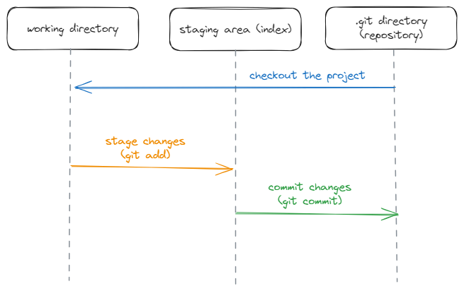

### **Git** - система контроля версий, которая отслеживает изменения в файлах

### **Репозиторий** - место, где хранятся и поддерживаются файлы

Копия проекта, которая подключена к Git и хранится на компьютере называется **local repository** (локальный репозиторий), после внесения изменений и их фиксирования данные могут быть отправлены в **remote repository** (удаленный репозиторий)

> Разница между Git, GitHub и GitHub Desktop?

- Git - программа для управления версиями (для работы в командной строке)
- GitHub - веб-сайт, на котором можно размещать репозиторий Git
- GitHub Desktop - программа, которая запускает Git на ПК и позволяет выполнять команды Git через графический интерфейс
 
### **Commit** - точка сохранения, которую можно создать во время разработки и которая включает в себя набор изменений кода

Файлы можно игнорировать (чтобы они не добавлялись в удаленный репозиторий) с помощью добавления их имени в файл **.gitignore.** Чтобы игнорировались, например, все файлы с расширением .txt, необходимо добавить знак звездочки (символ подстановки) - *.txt

### **Ветки** - возможность иметь несколько версий одного репозитория

### **Merge** - слияние двух веток в одну. Чтобы объединить первую ветку со второй необходимо находиться в первой ветке

Новые ветки объединяются с основной с помощью функции **"Pull request"**. Это позволяет другим участникам разработки проверить изменения в коде и одобрить их перед объединением с основной веткой

Так же можно выполнить **Revert** определенного commit после Pull request. Revert автоматически создает новую ветку с commit в главную ветку, который удаляет внесенные с помощью Pull request изменения

### Как можно связать локальный и удаленный репозиторий?

**Вариант 1**

1. Создать репозиторий на [GitHub](https://github.com/), создать локально папку с таким же именем, как и репозиторий на GitHub
2. В командной строке прописать команду `git init`. Эта команда превращает локальную папку в репозиторий
3. Далее необходимо прописать `git remote add origin URL`. Эта команда возьмет локальную папку и привяжет ее удаленному репозиторию

**Вариант 2**

1. Создать репозиторий на [GitHub](https://github.com/)
2. В командной строке прописать `git clone`

### Как добавить commit?

1. Необходимо проиндексировать файл с помощью команды `git add file.txt` (либо `git add .` - все файлы из директории или `git add -A` - все файлы в репозитории)

### **Индекс** - это промежуточная область, в которой хранятся изменения файлов на пути от рабочей директории до репозитория

2. Далее необходимо прописать `git commit -m 'commit: commit'.` Эта команда фиксирует изменения с определенным комментарием, указанным в ' '
3. Далее прописывается `git push origin main` (main - название ветки). Команда позволяет "толкнуть" commit с изменениями в указанную ветку удаленного репозитория

### Как происходит создание commit

Поелзные материалы:

- [Теория Git](https://lite.evernote.com/note/b1359883-2b9e-419a-b9de-dd959fc05f05)
- [Основы Git. Учебник](https://git-scm.com/book/ru/v2/%D0%92%D0%B2%D0%B5%D0%B4%D0%B5%D0%BD%D0%B8%D0%B5-%D0%9E-%D1%81%D0%B8%D1%81%D1%82%D0%B5%D0%BC%D0%B5-%D0%BA%D0%BE%D0%BD%D1%82%D1%80%D0%BE%D0%BB%D1%8F-%D0%B2%D0%B5%D1%80%D1%81%D0%B8%D0%B9)
- [The Git Community Book](https://uleming.github.io/gitbook/index.html)
- Тренажеры по Git: [1](https://learngitbranching.js.org/?locale=ru_RU), [2](https://githowto.com/ru)

Источники: [Git, GitHub, & GitHub Desktop for beginners](https://www.youtube.com/watch?v=8Dd7KRpKeaE), [JS/FE Stage#0 2022Q2 Git for beginners](https://www.youtube.com/watch?v=6i0Wg-Pohg8&list=PLzLiprpVuH8df24MzZp-l5QMsJWJbi9qP)